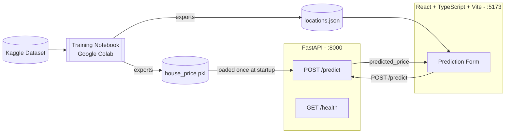

# House Price Prediction

Predicts Indian residential property prices from listing attributes (location,
carpet area, floor, bathrooms, balconies, furnishing, transaction type,
ownership, and facing direction). A scikit-learn pipeline trained in a
notebook is served behind a FastAPI backend and consumed by a React +
TypeScript frontend.

## Architecture



The notebook is an offline, one-time step: it cleans the raw data, trains and
compares models, and exports `house_price.pkl` (a full sklearn `Pipeline`,
so no manual encoding/scaling is needed anywhere downstream) plus
`locations.json` (the allowed location list for the frontend dropdown).

## Tech stack

| Layer      | Technology |
|------------|------------|
| Frontend   | React, TypeScript, Vite, react-router-dom |
| Backend    | FastAPI, Pydantic v2, pydantic-settings, Uvicorn |
| ML / data  | pandas, scikit-learn, joblib, Google Colab notebook |
| Dataset    | [House Price](https://www.kaggle.com/datasets/juhibhojani/house-price) by Juhi Bhojani (Kaggle) |

## Project structure

```
house-price-app/
├── notebook/
│   └── house_price_prediction.ipynb
├── backend/
│   ├── app/
│   │   ├── main.py                    # FastAPI app, CORS, model loaded at startup (lifespan)
│   │   ├── api/routes/prediction.py   # GET /health, POST /predict
│   │   ├── core/config.py             # Settings from .env (pydantic-settings)
│   │   ├── schemas/prediction.py      # PredictionRequest / PredictionResponse
│   │   ├── services/
│   │   │   ├── preprocessing.py       # Turns a request into a one-row DataFrame
│   │   │   └── inference.py           # Loads .pkl, runs predict
│   │   └── utils/logging_config.py
│   ├── models/
│   │   ├── house_price.pkl            # copied from the notebook (not committed if >50MB)
│   │   └── locations.json
│   ├── tests/test_prediction.py
│   ├── requirements.txt
│   ├── .env.example
│   └── Dockerfile
├── frontend/
│   └── src/
│       ├── api/predictionClient.ts
│       ├── components/PredictionForm.tsx
│       ├── pages/{HomePage,ResultPage,NotFoundPage}.tsx
│       ├── types/prediction.ts
│       └── App.tsx
├── .gitignore
└── README.md
```

## Dataset

Source: [Kaggle — House Price by Juhi Bhojani](https://www.kaggle.com/datasets/juhibhojani/house-price).
The raw CSV is not committed to this repo (see `.gitignore`) because of its
size. To download it yourself:

```bash
pip install kaggle
# Place your Kaggle API token at ~/.kaggle/kaggle.json first
# (Kaggle account -> Settings -> API -> Create New Token)

kaggle datasets download -d juhibhojani/house-price -p notebooks/data --unzip
```

This produces `notebooks/data/house_prices.csv`, which the notebook reads
directly.

## Getting started

### 1. Train / export the model (notebook)

Open `notebook/house_price_prediction.ipynb` in Colab or Jupyter, download
the dataset as above, and run all cells. This produces `house_price.pkl`
and `locations.json` — copy both into `backend/models/`.

### 2. Backend

```bash
cd backend
pip install -r requirements.txt
cp .env.example .env
# copy your house_price.pkl and locations.json into models/ first
uvicorn app.main:app --reload
# open http://localhost:8000/docs
```

### 3. Frontend

```bash
cd frontend
npm install
cp .env.example .env
# copy your locations.json into public/ first
npm run dev
# open http://localhost:5173
```

With both running, submit the form on `:5173` and confirm you get back a
real prediction from `:8000`.

## Environment variables

**`backend/.env`**

| Variable | Description | Example |
|---|---|---|
| `MODEL_PATH` | Path to the pickled pipeline | `models/house_price.pkl` |
| `LOCATIONS_PATH` | Path to the allowed-locations list | `models/locations.json` |
| `ALLOWED_ORIGINS` | Comma-separated CORS origins | `http://localhost:5173` |

**`frontend/.env`**

| Variable | Description | Example |
|---|---|---|
| `VITE_API_BASE_URL` | Base URL of the backend API | `http://localhost:8000` |

## API reference

### `GET /health`

```json
{ "status": "ok" }
```

### `POST /predict`

Request body:

| Field | Type | Notes |
|---|---|---|
| `location` | string | Must be one of `locations.json`, or `"other"` |
| `carpet_area_sqft` | float | > 0 |
| `floor_num` | int | ≥ 0 |
| `bathroom` | int | ≥ 0 |
| `balcony` | int | ≥ 0 |
| `furnishing` | string | `"Furnished"` \| `"Semi-Furnished"` \| `"Unfurnished"` |
| `transaction` | string | `"New Property"` \| `"Resale"` |
| `ownership` | string | e.g. `"Freehold"` |
| `facing` | string | e.g. `"East"` |

Example:

```bash
curl -X POST http://localhost:8000/predict \
  -H "Content-Type: application/json" \
  -d '{
    "location": "sector-1",
    "carpet_area_sqft": 1250,
    "floor_num": 4,
    "bathroom": 3,
    "balcony": 2,
    "furnishing": "Furnished",
    "transaction": "Resale",
    "ownership": "Freehold",
    "facing": "East"
  }'
```

Response:

```json
{ "predicted_price": 6400000.0 }
```

## Model performance

Selected from a comparison of Linear Regression and Random Forest, each
trained on both raw and `log1p`-transformed price (see notebook section
2.4). Fill in from your notebook's `results_df` output:

| Model | Log target | MAE (₹) | RMSE (₹) | R² |
|---|---|---|---|---|
| _RandomForestRegressor  -- winning row from `results_df`_ | | | | |

5-fold cross-validated RMSE (from the `cross_val_score` bonus cell): `<fill in>`

## Screenshots

_Add screenshots of the running app to a `screenshots/` folder and reference
them here, e.g.:_

```markdown


```

## License

This project is for educational purposes as part of a student guide. The
dataset is licensed separately by its original author on Kaggle.
